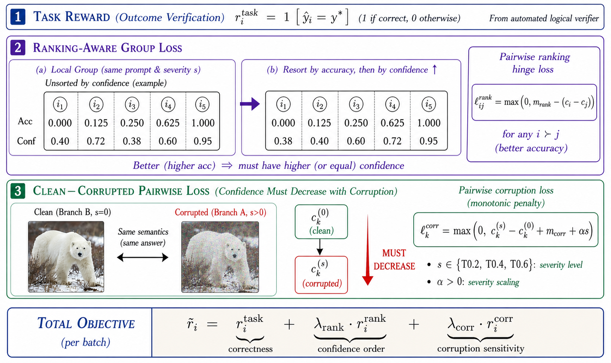

# RAC: Ranking-Aware Calibration for Reliable Multimodal Reinforcement Learning

Official code repository for "Ranking-Aware Calibration for Reliable Multimodal Reinforcement Learning".

RAC is a training-time calibration framework for multimodal reinforcement learning. Standard outcome rewards improve reasoning accuracy, but they do not explicitly teach a model when to lower confidence, especially under corrupted visual evidence. RAC adds two relative supervision signals that already exist in group-based RL rollouts:

- Ranking-aware group loss: within the same prompt, better rollouts should receive higher confidence than worse rollouts.
- Clean-corrupted pairwise loss: confidence should decrease as the visual evidence is degraded.

We instantiate RAC on Qwen2.5-VL and InternVL-3.5 backbones and evaluate on six multimodal reasoning benchmarks under clean and corrupted inputs. The code in this repository is a cleaned research release built on top of verl, keeping only the components needed to reproduce the RAC training and data pipeline.


## Overview

RAC targets a simple failure mode in multimodal RL: a model can learn to produce more correct answers while still remaining overconfident on wrong answers, and this often becomes worse when the image input is noisy or ambiguous. RAC addresses this with two training-time objectives:

- Ranking-aware calibration: confidence should rank candidate rollouts by reasoning quality within the same question.
- Corruption-aware calibration: confidence should attenuate when the same question is observed through lower-quality visual evidence.

These signals are converted into reward shaping terms and optimized jointly with the base RL objective.

## What Is In This Repository

- examples/confidence_rl/
  Launcher scripts for the RAC training runs used in the paper.
- verl/trainer/reward_fn/confidence_dataset.py
  Dataset wrapper for confidence-bearing multimodal RL samples.
- verl/trainer/reward_fn/reward_shaping.py
  RAC reward shaping logic, including ranking-aware and clean-corrupted pairwise terms.
- verl/tools/build_corrupted_datasets.py
  Corruption builder for RAC training and evaluation datasets.
- verl/tools/imagenetc_corruptions.py
  Corruption operators adapted for variable-size images.

## Benchmarks And Models

The released code covers the experiments described in the paper:

- Backbones: Qwen2.5-VL-3B/7B-Instruct and InternVL3.5-8B.
- Benchmarks: m3cot, mathverse, mathvision, mmmu, scienceqa, and we-math.
- Corruption settings: clean plus five severity levels from T0.2 to T1.0.

The launcher scripts evaluate 36 validation sets in total: 6 benchmarks multiplied by 6 conditions (clean plus 5 corruption levels).

## Installation

RAC assumes a CUDA-capable training environment compatible with verl-style multimodal RL jobs. We recommend starting from an environment that already has the correct PyTorch, vLLM, and FlashAttention stack for your cluster, then installing the repository dependencies.

```bash
conda create -n rac python=3.11 -y
conda activate rac

pip install -r requirements.txt
pip install -e .
```

Notes:

- vLLM installation is environment-specific and may need to be installed separately for your CUDA stack.
- The corruption builder requires pillow, scipy, and opencv-python-headless, which are already listed in requirements.txt.

## Data Preparation

If you want local copies of the six public benchmark sources for preprocessing or provenance, materialize datasets first:

```bash
python -m verl.tools.build_corrupted_datasets \
  --mode download_sources \
  --source_download_root ./upstream_sources
```

Public source dataset URLs:

- M3CoT: [LightChen233/M3CoT](https://huggingface.co/datasets/LightChen233/M3CoT)
- MathVerse: [AI4Math/MathVerse](https://huggingface.co/datasets/AI4Math/MathVerse)
- MathVision: [mathvision-bench/MathVision](https://huggingface.co/datasets/mathvision-bench/MathVision)
- MMMU: [MMMU/MMMU](https://huggingface.co/datasets/MMMU/MMMU)
- ScienceQA: [derek-thomas/ScienceQA](https://huggingface.co/datasets/derek-thomas/ScienceQA)
- We-Math: [We-Math/We-Math](https://huggingface.co/datasets/We-Math/We-Math)

After your local RAC working tree is prepared, generate corrupted training pairs, the mixed pair_main split, and corrupted test sets:

```bash
python -m verl.tools.build_corrupted_datasets \
  --data_root ./your_data \
  --mode all
```

You can combine the optional source download step with corruption generation in one command:

```bash
python -m verl.tools.build_corrupted_datasets \
  --data_root ./your_data \
  --download_sources \
  --source_download_root ./upstream_sources \
  --mode test_corrupt
```

Supported modes:

- download_sources: materialize the six public benchmark snapshots into a local source directory.
- train_pairs: build train_pair_T0.2 to train_pair_T1.0.
- train_main: build train_pair_main with the 50/40/10 noisy mixture used in the paper.
- test_corrupt: build corrupted benchmark test sets.

## Training

The main paper runs are launched from examples/confidence_rl.

Qwen2.5-VL-3B/7B-Instruct:

```bash
DATA_ROOT=/path/to/your_data \
EXP=pair_main \
bash examples/confidence_rl/run_qwen2_5_vl_3b/7b_instruct.sh
```

InternVL3.5-8B:

```bash
DATA_ROOT=/path/to/your_data \
EXP=pair_main \
bash examples/confidence_rl/run_internvl3_5_8b.sh
```

Supported experiment switches:

- baseline
- ranking
- pair_T0.2
- pair_T0.4
- pair_T0.6
- pair_T0.8
- pair_T1.0
- pair_main

Both launcher scripts support a dry-run mode that expands the resolved model, dataset, cache, and validation paths without starting training:

```bash
DRY_RUN=1 \
DATA_ROOT=/path/to/your_data \
bash examples/confidence_rl/run_qwen2_5_vl_7b_instruct.sh
```

## Paper Summary

The paper studies calibration as a first-class training objective in multimodal RL rather than a post-hoc correction step. RAC uses rollout comparisons that are already available during training and adds no external confidence annotations. Empirically, the ranking-aware loss improves accuracy by making the policy discriminate better between strong and weak reasoning paths, while the clean-corrupted pairwise loss improves calibration under degraded visual evidence. Their combination gives the best overall trade-off across the tested backbones and benchmarks.

## License

This project is released under the Apache-2.0 License. See LICENSE for details.

## Note

During the completion of this work, we had to replace the server and migrate all data. This may have caused damage to a very small number of files. Although we have conducted comprehensive experimental verification on the new server to ensure full functionality, please feel free to contact us if you find any issues with this repository. We will provide support to help you reproduce our experimental results.🤗
